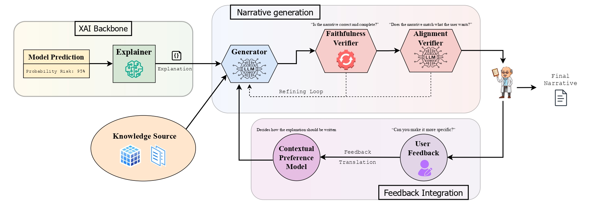

# PONTE: Personalized Orchestration for Natural Language Trustworthy Explanations

This repository implements a modular pipeline designed to translate raw **Explainable AI (XAI)** data into user-tailored narratives. By utilizing a **Contextual Preference Model (CPM)** and a multi-stage **Verification Loop**, the system ensures that explanations are both faithful to the underlying model and stylistically aligned with the target audience.



---

## Use Case

The system targets two domains:

- **Clinical decision support** for diabetes risk prediction
- **Consumer lending** for credit risk assessment (LendingClub)

It transforms complex statistical outputs—**SHAP impact values** and **DiCE counterfactuals**—into coherent natural language explanations. The pipeline dynamically adapts its tone and content based on the user profile.

---

## Repository Structure

The repository follows a modular architecture that separates data processing, style modeling, narrative generation, and verification:

- **`src/components/a_setup_xai.py`**: Handles dataset loading, model training, and SHAP/DiCE generation.
- **`src/components/b_cpm.py`**: The **Contextual Preference Model**. Defines style vectors for different user roles.
- **`src/components/c_generator.py`**: Narrative engine. Interfaces with Ollama to synthesize explanations using templates and instructions.
- **`src/components/d_verifiers.py`**: Verification suite. Performs rejection sampling for faithfulness and stylistic alignment.
- **`src/components/e_feedback_translator.py`**: Converts natural language feedback into actionable correction hints for the LLM.
- **`src/components/f_refiner.py`**: Refines candidate explanations using structured feedback.
- **`src/components/g_rag.py`**: Optional RAG pipeline for grounded explanations.
- **`src/components/llm_client.py`**: LLM client wrapper for local or cloud [Ollama](https://ollama.com/) and [Groq](https://groq.com/).
- **`src/config/`**: Dataset-specific configs (e.g., `config_diabetes.yaml`, `config_lendingclub.yaml`).
- **`src/prompts/`**: Dataset-specific prompts and rubrics (e.g., `prompts_diabetes.yaml`, `prompts_lendingclub.yaml`).
- **`src/orchestrator.py`**: Execution core. Manages the generation–verification loop.
- **`src/dataset.py`**: Dataset utilities and normalization.
- **`src/baseline_experiment.py`** / **`src/ponte_experiment.py`**: Experiment runners.
- **`src/agent_judge_eval.py`**: Agent-as-a-Judge evaluation pipeline.
- **`data/`**: Raw data, knowledge bases, and ChromaDB artifacts.
- **`results/`**: Baseline, PONTE, and evaluation outputs.
- **`webui/`**: Streamlit app for interactive runs.

---

## Getting Started

`uv` and `pip` differ only in how you install dependencies and run Python. All other steps are identical.

### 1) Install dependencies (choose one)

**Using uv (recommended):**

```bash
uv sync
```

**Using pip:**

```bash
pip install -r requirements.txt
```

### 2) Set up the LLM backend (common)

**Local mode (no auth required):** ensure Ollama is running locally and pull both the generation and embedding models:

```bash
ollama serve
ollama pull gpt-oss:20b
ollama pull embeddinggemma
```

**Cloud mode (requires auth):** authenticate, then pull and use the cloud model (embedding model is still required):

```bash
# API key via environment
export OLLAMA_API_KEY="<your_api_key>"

# Start the Ollama server and pull the cloud model
ollama serve
ollama pull gpt-oss:20b-cloud
ollama pull embeddinggemma
```

### 3) Configure settings (common)

Adjust numerical tolerances in `src/config/config_{dataset}.yaml` and refine stylistic behaviors or categorical levels in `src/prompts/prompts_{dataset}.yaml` as needed.

---

## Usage

To generate a verified narrative for a specific case (by default, the orchestrator selects the highest-risk instance for testing), run:

```bash
# uv
uv run python3 -m src.orchestrator --interactive --dataset <dataset> --role <persona>
```

```bash
# pip / system python
python3 -m src.orchestrator --interactive --dataset <dataset> --role <persona>
```

Available datasets: `diabetes`, `lendingclub`.
